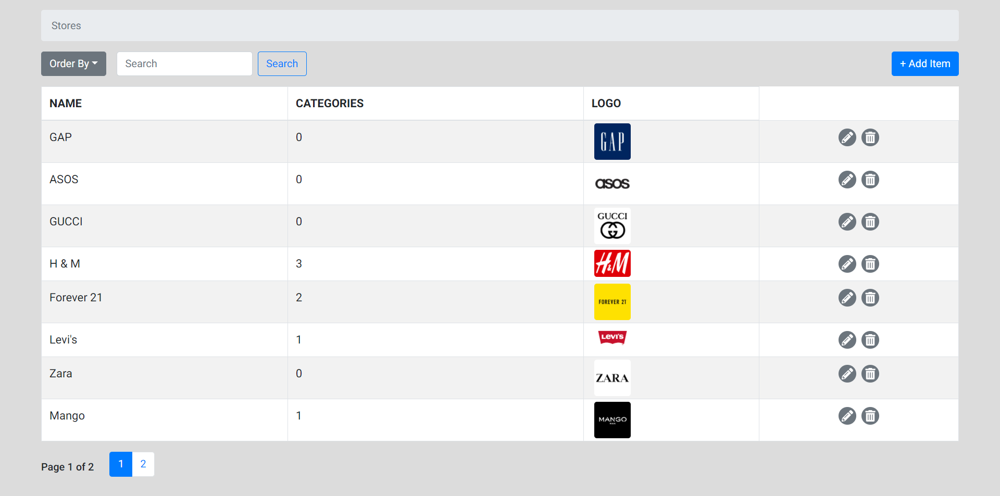

## Stores Admin Panel

An admin panel that allows its user to create a list of clothes shopping stores and add categories and items to each store.

#### To run the express server on port 5000

`cd api`

`npm install`

`npm start`

#### To run the react app on port 3000

`cd client`

`yarn install`

`yarn start`

| Methods | Urls               | Actions                               | Done |
| ------- | ------------------ | ------------------------------------- | ---- |
| GET     | api/stores         | get all stores                        | Yes  |
| GET     | api/stores/:id     | get all Categories based on store_id  | Yes  |
| GET     | api/categories/:id | get all Products based on category_id | Yes  |
| GET     | api/products/:id   | get Product by id                     | Yes  |
| POST    | api/stores         | add new Store                         | Yes  |
| POST    | api/categories     | add new Category                      | Yes  |
| POST    | api/products       | add new Product                       | Yes  |
| PUT     | api/stores/:id     | update Store by id                    | Yes  |
| PUT     | api/categories/:id | update Category by id                 | Yes  |
| PUT     | api/products/:id   | update Product by id                  | Yes  |
| DELETE  | api/stores/:id     | remove Store by id                    | No   |
| DELETE  | api/categories/:id | remove Category by id                 | No   |
| DELETE  | api/products/:id   | remove Product by id                  | No   |
